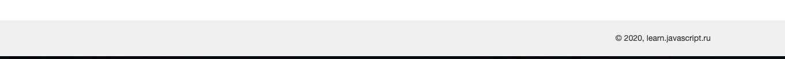

## Интерполяция, связывание данных и межкомпонентная коммуникация

  В этом задании предлагаю сделать компонент footer. Вам нужно Вывести данные об авторе и текущему году в шаблоне.

  Для успешного выполнения  вам необходимо ознакомиться с документацией(README в папке модуля).

  

  Не меняйте структуру html и стили компонетов

  Для запуска окружения непрерывной разработки выполните команду

  ```bash
  npm run start:1-components_2-footer
  ```

  Для проверки своего решения выполните

  ```bash
  npm run test:1-components_2-footer
  ```

  Для проверки стилистики кода

  ```bash
  npm run lint:1-components_2-footer
  ```
