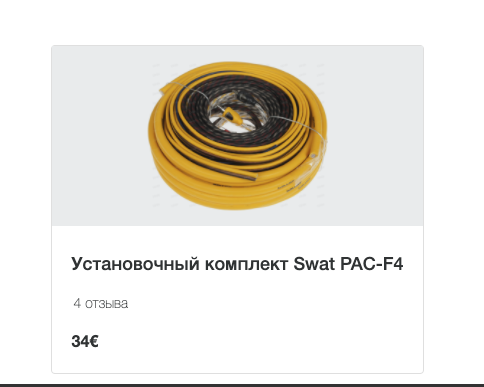

## Интерполяция, связывание данных и межкомпонентная коммуникация

  В этом задании предлагаю сделать компонент карточки товара со страницы рекомендаций. Вам нужно Вывести данные о товаре в шаблоне.
  Данные должны приходить из родительского компонента. А так же обработать событие перехода на страницу товара (без реальной навигации).
  Все события должны быть связанны с родительским компонентом.

  Для успешного выполнения  вам необходимо ознакомиться с документацией(README в папке модуля).

  

  Не меняйте структуру html и стили компонетов

  Для запуска окружения непрерывной разработки выполните команду

  ```bash
  npm run start:1-components_4-suggested-product
  ```

  Для проверки своего решения выполните

  ```bash
  npm run test:1-components_4-suggested-product
  ```

  Для проверки стилистики кода

  ```bash
  npm run lint:1-components_4-suggested-product
  ```
