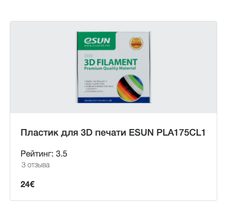

## Pipes и их применение

Товары которые приходят с сервера имеют структуру
```ts
export interface IProduct {
  _id: string;
  subCategory: string;
  feedbacksCount: number;
  count?: number;
  name: string;
  description: string;
  feedbacks?: IFeedback;
  characteristics?: ICharacteristics[];
  price: number;
  status: boolean;
  images: IProductImage[];
  rating: number;
}

export interface IProductImage {
  url: string;
  source: string;
}

```
1. Как видно поле images содержит ряд изображений, которые относятся к товару.
Напишите pipe который при пременению к полю images будет возвращать путь к первому изображению
2. Поле rating содержит оценки 0 - 5. Напишите pipe который будет выполнять округления. Возьмем число от 1 до 2. Если дробная часть 
меньше .25 округляем до 1. Если >= 0.25 и < 0.75 округляем до 1.5. Остальное до 2
3. feedbacksCount содержит число отзывов. Напишите pipe, который будет добавлять слово отзыв в нужном падеже. Например 1 отзыв, 11 отзывов и так далее. 



Не меняйте структуру html и стили компонетов

Для запуска окружения непрерывной разработки выполните команду

```bash
npm run start:2-pipe_1-transforms-with-pipe
```

Для проверки своего решения выполните

```bash
npm run test:2-pipe_1-transforms-with-pipe
```

Для проверки стилистики кода

```bash
npm run lint:2-pipe_1-transforms-with-pipe
```
