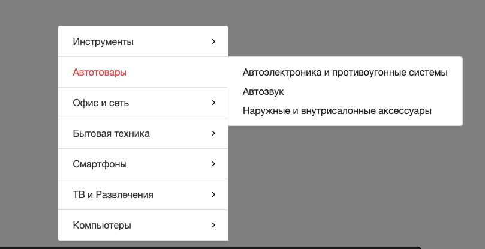

## Директивы

В этом задании предлагаю сделать компонент меню выбора подкатегории товара. Вам нужно сформирвать вложеный список категорий и подкатегорий. 
Данные должны приходить из родительского компонента. А так же обработать событие перехода на соответствующую подкатегорию.
Вам необходимо ознакомиться с документацией(README в папке модуля).
Также вы можете ознакомиться со скринкастами по данной теме.



Не меняйте структуру html и стили компонетов

Для запуска окружения непрерывной разработки выполните команду

```bash
npm run start:3-directives_1-categories-menu-component
```

Для проверки своего решения выполните

```bash
npm run test:3-directives_1-categories-menu-component
```

Для проверки стилистики кода

```bash
npm run lint:3-directives_1-categories-menu-component
```
