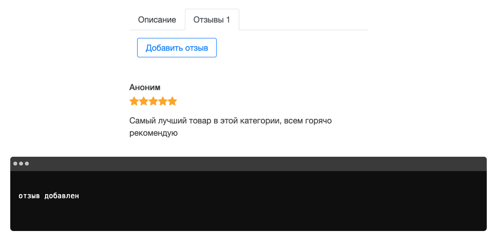

## Директивы

В этом задании предлагаю сделать компонент описания товара и отзывов о нем. Вам нужно отобразить описание товара, кнопку добавления отзыва и список всех отзывов о товаре.
Данные должны приходить из родительского компонента. А так же необходимо обработать событие добавления отзыва.
Вам необходимо ознакомиться с документацией (README в папке модуля).
Также вы можете ознакомиться со скринкастами по данной теме.



Не меняйте структуру html и стили компонетов

Для запуска окружения непрерывной разработки выполните команду

```bash
npm run start:3-directives_3-description-component
```

Для проверки своего решения выполните

```bash
npm run test:3-directives_3-description-component
```

Для проверки стилистики кода

```bash
npm run lint:3-directives_3-description-component
```
