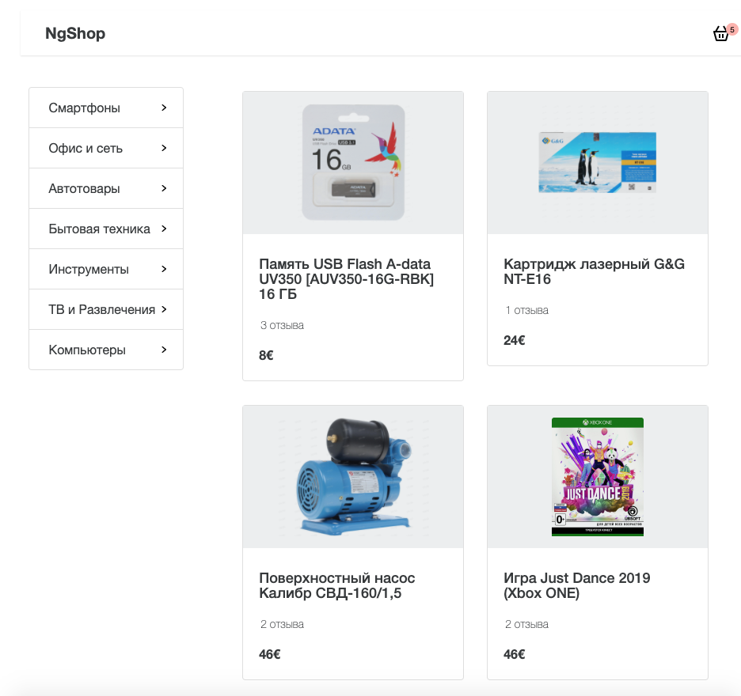
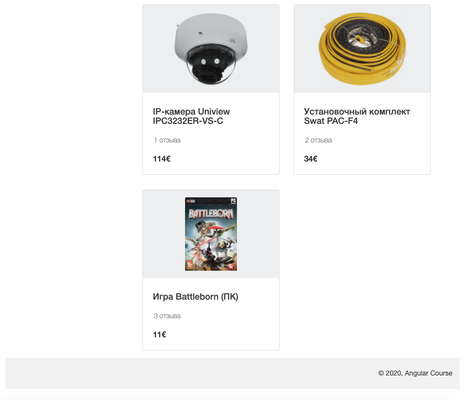

## Сервисы

В этом задании предлагаю сделать компонент страницы продукта. Вам нужно отобразить компоненты header, menu, products, footer. Получение продуктов и категорий выполнить с помощью сервисов. Так же необходимо использовать interceptor для перехвата HTTP-запросов перед их отправкой и добавления заголовков к запросам. Необходимый baseUrl указан в environment.
Вам необходимо ознакомиться с документацией (README в папке модуля).
Также вы можете ознакомиться со скринкастами по данной теме.




Не меняйте структуру html и стили компонетов

Для запуска окружения непрерывной разработки выполните команду

```bash
npm run start:4-services_1-home-page-component
```

Для проверки своего решения выполните

```bash
npm run test:4-services_1-home-page-component
```

Для проверки стилистики кода

```bash
npm run lint:4-services_1-home-page-component
```
